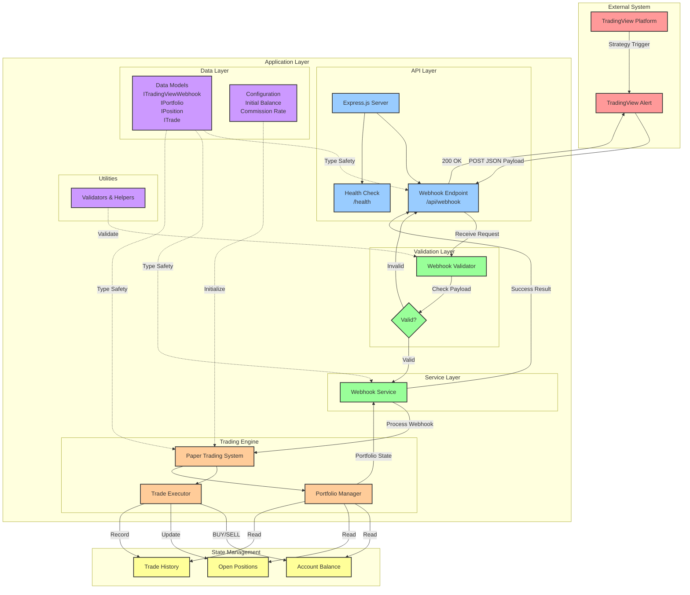

# Paper Trading Webpage

A TypeScript-based web application that enables paper trading through TradingView webhook integration. This project provides a risk-free environment for practicing trading strategies by simulating real market trades without using actual money.

## What is Paper Trading?

Paper trading is a simulated trading process that allows users to practice trading strategies without risking real money. It provides a safe environment for:
- Testing trading strategies
- Learning market mechanics
- Gaining trading experience
- Validating trading algorithms
- Building confidence before real trading

Unlike real trading, paper trading:
- Uses virtual money instead of real funds
- Has no actual financial risk
- Allows for experimentation with different strategies
- Provides a learning environment without emotional pressure
- Enables rapid testing of multiple trading approaches

## TradingView Webhook Integration

This application integrates with TradingView's webhook functionality to automate paper trading based on TradingView alerts and indicators. Here's how it works:

### Webhook Event Processing

1. **Event Reception**: The application exposes an endpoint that receives webhook events from TradingView
2. **Event Structure**: Webhook events contain the following information:
   ```typescript
   interface TradingViewWebhook {
     symbol: string;                                   // Trading pair or asset
     action: 'BUY' | 'SELL' | 'LIMIT_BUY' | 'LIMIT_SELL'; // Trade direction
     price: number;                                    // Entry/exit price or limit price
     quantity: number;                                 // Trade size
     strategy: string;                                 // Strategy identifier
     timestamp: number;                                // Event timestamp
   }
   ```
3. **Processing Flow**:
   - Webhook event validation
   - Trade execution in paper trading environment
   - Position management and tracking
   - Performance calculation and reporting

### Trading Actions

The system supports the following trading actions:
- Market orders (buy/sell) - executed immediately at current market price
- Limit orders (limit_buy/limit_sell) - executed only when price reaches the specified limit
- Position tracking
- Portfolio management
- Performance analytics

#### Limit Orders

Limit orders allow you to set conditional trades that execute only when the market reaches your specified price:

- **LIMIT_BUY**: Creates a buy order that executes when the market price drops to or below the specified limit price
- **LIMIT_SELL**: Creates a sell order that executes when the market price rises to or above the specified limit price

Limit orders help you:
- Enter positions at better prices
- Take profits automatically
- Manage risk without constantly monitoring the market
- Execute trades even when you're not actively watching

## Installation and Setup

### Prerequisites

- Node.js (v14 or higher)
- npm or yarn
- TypeScript 4.x

### Installation Steps

1. Clone the repository:
   ```bash
   git clone https://github.com/yourusername/paper-trading-webpage.git
   cd paper-trading-webpage
   ```

2. Install dependencies:
   ```bash
   npm install
   # or
   yarn install
   ```

3. Configure environment variables:
   ```bash
   cp .env.example .env
   # Edit .env with your settings
   ```

4. Build the project:
   ```bash
   npm run build
   # or
   yarn build
   ```

5. Start the application:
   ```bash
   npm start
   # or
   yarn start
   ```

### Available Scripts

The following scripts are available in the package.json:

- `npm run build`: Compiles TypeScript code to JavaScript in the dist directory
- `npm run test`: Runs Jest tests
- `npm run lint`: Runs ESLint to check code quality
- `npm run lint:fix`: Runs ESLint and automatically fixes issues when possible
- `npm run start`: Starts the application in production mode
- `npm run dev`: Starts the application in development mode with hot reloading
- `npm run typecheck`: Runs TypeScript compiler to check types without emitting files

### Development Workflow

For development, you can use the following workflow:

1. Start the development server:
   ```bash
   npm run dev
   ```

2. Make changes to the code
3. Run tests to ensure everything works:
   ```bash
   npm run test
   ```

4. Check code quality:
   ```bash
   npm run lint
   ```

5. Build the project for production:
   ```bash
   npm run build
   ```

## Usage Examples

### Configuring TradingView Webhooks

1. Create a new alert in TradingView:
   ```javascript
   // TradingView Pine Script Example
   strategy("My Strategy", overlay=true)
   longCondition = crossover(sma(close, 14), sma(close, 28))
   if (longCondition)
       strategy.entry("Long", strategy.long)
   ```

2. Set up webhook in TradingView alert:
   ```json
   {
     "symbol": "{{ticker}}",
     "action": "BUY",
     "price": {{close}},
     "quantity": 1,
     "strategy": "SMA_CROSS",
     "timestamp": {{time}}
   }
   ```

3. For limit orders, use LIMIT_BUY or LIMIT_SELL actions:
   ```json
   {
     "symbol": "{{ticker}}",
     "action": "LIMIT_BUY",
     "price": 50000,
     "quantity": 0.1,
     "strategy": "DIP_BUY",
     "timestamp": {{time}}
   }
   ```

### Managing Paper Trades

```typescript
// Example of interacting with the paper trading system
import { PaperTradingSystem } from './trading';

const trader = new PaperTradingSystem({
  initialBalance: 10000,
  commission: 0.1
});

// Execute a paper trade
trader.executeTrade({
  symbol: 'BTCUSDT',
  action: 'BUY',
  price: 50000,
  quantity: 0.1
});

// Get portfolio status
const portfolio = trader.getPortfolio();
console.log('Current Balance:', portfolio.balance);
console.log('Open Positions:', portfolio.positions);
console.log('Active Limit Orders:', portfolio.limitOrders);

// Create a limit order
trader.executeTrade({
  symbol: 'BTCUSDT',
  action: 'LIMIT_BUY',
  price: 48000, // Will execute when price drops to 48000 or below
  quantity: 0.1
});

// Check and execute limit orders based on current market price
trader.checkAndExecuteLimitOrders('BTCUSDT', 47500);
```

### Managing Limit Orders via API

The system provides REST API endpoints for managing limit orders:

```bash
# Get all active limit orders
GET /api/limit-orders

# Get limit orders for a specific symbol
GET /api/limit-orders/BTCUSDT

# Cancel a specific limit order
DELETE /api/limit-orders/limit_123

# Manually trigger price check for limit orders
POST /api/limit-orders/check-price
Content-Type: application/json
{
  "symbol": "BTCUSDT",
  "price": 49000
}
```

## Project Structure

```
paper-trading-webpage/
├── src/
│   ├── api/              # API endpoints and webhook handlers
│   ├── trading/          # Trading system implementation
│   ├── models/           # Data models and interfaces
│   ├── services/         # Business logic services
│   ├── utils/            # Utility functions
│   └── config/           # Configuration files
├── test/                 # Test files
├── public/              # Static assets
└── dist/               # Compiled output
```

### Architecture

The application follows a modular architecture with clear separation of concerns:

- **API Layer**: Handles incoming webhook requests and HTTP endpoints
- **Trading Engine**: Manages paper trading logic and position tracking
- **Data Models**: TypeScript interfaces and types for type safety
- **Services**: Business logic and external integrations
- **Utils**: Shared utilities and helper functions

## System Architecture Diagram

The following diagram illustrates the system components and their interactions:



### Component Descriptions

#### External System
- **TradingView Platform**: Third-party trading platform that generates trading signals
- **TradingView Alert**: Configured alerts that trigger webhooks when conditions are met

#### API Layer
- **Express.js Server**: Node.js web server handling HTTP requests
- **Webhook Endpoint**: POST endpoint (`/api/webhook`) receiving TradingView alerts
- **Health Check**: GET endpoint (`/health`) for monitoring application status

#### Validation Layer
- **Webhook Validator**: Validates incoming webhook payloads against required schema
- **Validation Result**: Determines if webhook data is valid before processing

#### Service Layer
- **Webhook Service**: Business logic for processing validated webhooks and orchestrating trade execution

#### Trading Engine
- **Paper Trading System**: Core trading logic managing simulated trades
- **Trade Executor**: Executes buy/sell orders and calculates commissions
- **Portfolio Manager**: Tracks current portfolio state including balance, positions, and history

#### Data Layer
- **Data Models**: TypeScript interfaces ensuring type safety across the application
- **Configuration**: Application settings (initial balance, commission rates, etc.)
- **Utilities**: Helper functions for validation and data processing

#### State Management
- **Account Balance**: Current available funds in the paper trading account
- **Open Positions**: Active trading positions with entry prices and quantities
- **Trade History**: Complete record of all executed trades

### Data Flow

1. **Webhook Reception**: TradingView sends JSON payload to `/api/webhook`
2. **Validation**: Payload is validated for required fields and correct data types
3. **Processing**: Valid webhooks are processed by the webhook service
4. **Trade Execution**: Paper trading system executes the trade (BUY/SELL)
5. **State Update**: Portfolio state is updated (balance, positions, history)
6. **Response**: Success response with updated portfolio is returned to TradingView

## Development Guidelines

### Code Standards

- Use TypeScript strict mode
- Follow ESLint configuration
- Write unit tests for all new features
- Document public APIs and interfaces

### Pull Request Process

1. Create feature branch from `main`
2. Write tests for new functionality
3. Update documentation as needed
4. Submit PR with descriptive title and details
5. Ensure CI passes and get code review

### Testing Requirements

- Unit tests for all new features
- Integration tests for API endpoints
- E2E tests for critical flows
- Maintain 80%+ code coverage

### TypeScript Guidelines

- Use strict type checking
- Avoid `any` type
- Document complex types
- Use interfaces for object shapes

## Contributing

1. Fork the repository
2. Create your feature branch
3. Commit your changes
4. Push to your fork
5. Create a Pull Request

## License

This project is licensed under the MIT License - see the [LICENSE](LICENSE) file for details.